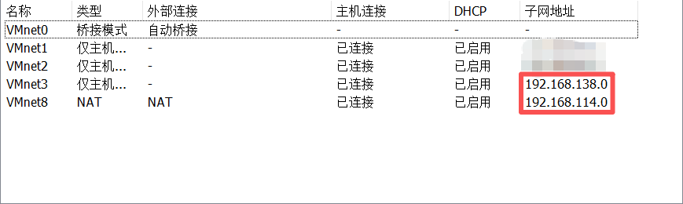
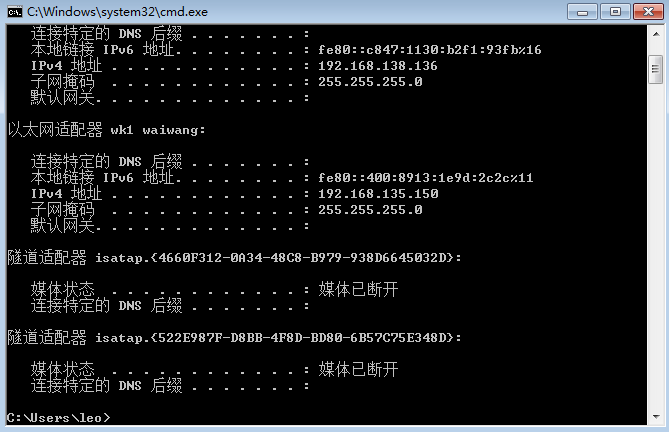
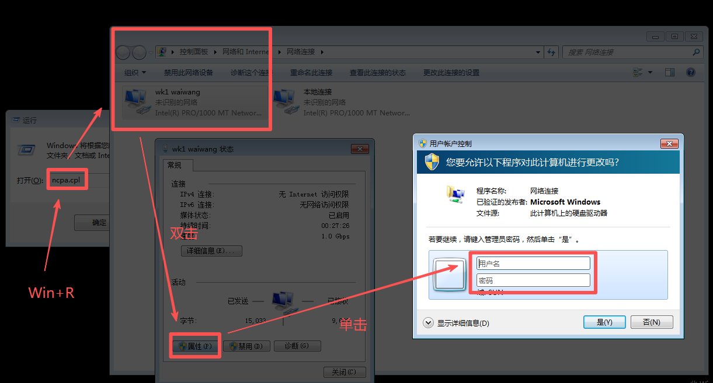
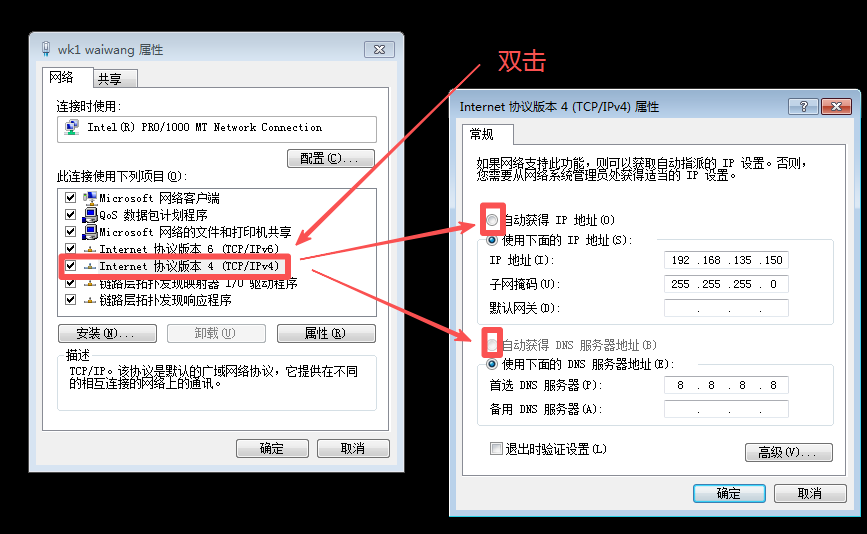

# 红日靶场 5 蒟蒻笔记

---

## 目录

>[!ERROR]
>
>After finishing this whole notes, remember to build TOC

---

## 环境配置

>[!CAUTION]
>
> **警告！**
>
> 为保证不发生不可预测的严重后果，请不要在真实的网络环境中进行此实验。请在虚拟机环境中完成本试验。推荐使用 [VMware Workstation Pro](https://vmware.xznkjzx.cn/)。

>[!IMPORTANT]
>
>1. 你需要下载 [红日靶场 5](http://vulnstack.qiyuanxuetang.net/vuln/detail/7/)
>2. 推荐使用 [kali](https://www.kali.org/) 作为攻击机。

### 靶机配置

>[!TIP]
>
>有概率你会获得一堆尸块……
>
>具体结构可能如下所示:
>
>```text
>.
>├── 尸块 1
>├── 尸块 2
>├── windows 2008 dc/
>├── 尸块 3
>├── 尸块 x
>└── 尸块 end
>```
>
>这个靶场只有两个靶机，所以把这些尸块们打包好放到一个新的可以命名为 win7 的新文件夹里，形成如下结构：
>
>```text
>.
>├── win7/
>└── windows 2008 dc/
>```

1. 通过扫描红日靶场 5 的本地存储目录添加虚拟机。
2. 编辑 $\rightarrow$ 虚拟网络编辑器 $\rightarrow$ 更改配置 $\rightarrow$ 配置网络如下（只用管 VMnet3 和 VMnet8，其中 VMnet8 的NAT 模式无需保证子网地址一致，但 VMnet3 一定要保证子网地址一致）：

3. 依次编辑两台靶机设置，调整 ```网络适配器``` 为 ```自定义(VMnet3)```
4. 编辑 win7 靶机设置，添加 ```网络适配器 2``` 为 ```NAT``` 模式
5. 进入靶机 windows 2008 dc，密码为：```2020.com```，极大概率会让你重置密码，我们重置为 ```win2008.com```
6. 进入靶机 win7，密码为：```123.com```
7. 进入各靶机，打开 ```cmd``` 或 ```powershell```，运行指令 ```ipconfig``` 查看本机 ip 地址。应如下：

| 机器名称 | ip 地址（VMnet3） |
|:-:|:-:|
| windows 2008 | 192.168.138.138 |
| win7 | 192.168.138.136 |

8. 为方便后续操作进行，现展示本蒟蒻的 ```NAT``` 模式下的 kali 和 win7 的 ip 地址，在笔记用到下面 ip 地址时，请替换为自己对应虚拟机的 ip 地址。（在 kali 中，命令变为 ```ifconfig```）

| 机器名称 | ip 地址（NAT） |
|:-:|:-:|
| kali | 192.168.114.130 |
| win7 | 192.168.114.128 |

>[!TIP]
>
>当我们使用命令 ```ipconfig``` 确认检查各虚拟机 IP 地址时有概率发现 win7 的 “以太网适配器 wk1 waiwang” 网络连接，也就是理论上被我们设置为 NAT 模式的网卡一直在使用一个 ```192.168.135.150``` 的 IP 地址。
>
>
>
>我们需要使用 Win+R 快捷键并输入 ```ncpa.cpl``` 打开网络连接控制面板双击 “wk1 waiwang”，单击属性，输入管理员账号密码：```Administrator/dc123.com```
>
>
>
>双击 “Internet 协议版本4 (TCP/IPv4)属性”，改成 “自动获得 IP 地址” 与 “自动获得 DNS 服务器地址”，一路点击 “确定” 保存设置修改。
>
>

启动 phpStudy 时会让你输入管理员账号密码：```Administrator/dc123.com```

---

## 参考文献

1. [红日靶场05通关记录](https://cn-sec.com/archives/1040933.html)