# 红日靶场 5 蒟蒻笔记

---

## 目录

- [环境配置](#环境配置)
  - [靶机配置](#靶机配置)
  - [ThinkPHP 漏洞利用 GUI 工具 安装与使用教程](#thinkphp-漏洞利用-gui-工具-安装与使用教程)
  - [冰蝎 安装与使用教程](#冰蝎-安装与使用教程)
  - [Cobalt Strike 安装与使用教程](#cobalt-strike-安装与使用教程)
- [实验过程](#实验过程)
  - [启动服务网页服务](#启动服务网页服务)
  - [外网信息搜集](#外网信息搜集)
    - [网段扫描](#网段扫描)
    - [端口扫描](#端口扫描)
  - [突破外网服务器](#突破外网服务器)
    - [漏洞扫描](#漏洞扫描)
    - [getshell](#getshell)
  - [内网渗透](#内网渗透)
    - [CS 上线](#cs-上线)
    - [隐蔽进程](#隐蔽进程)
    - [提升权限](#提升权限)
    - [内网信息搜集](#内网信息搜集)
    - [横向移动](#横向移动)
    - [制作黄金票据](#制作黄金票据)
- [完成实验](#完成实验)
- [实验清理](#实验清理)
- [参考文献](#参考文献)

---

## 环境配置

>[!CAUTION]
>
> **警告！**
>
> 为保证不发生不可预测的严重后果，请不要在真实的网络环境中进行此实验。请在虚拟机环境中完成本试验。推荐使用 [VMware Workstation Pro](https://vmware.xznkjzx.cn/)。

>[!IMPORTANT]
>
>1. 你需要下载 [红日靶场 5](http://vulnstack.qiyuanxuetang.net/vuln/detail/7/)
>2. 推荐使用 [kali](https://www.kali.org/) 作为攻击机。
>3. 建议在实验前，下载并安装好 [ThinkPHP 漏洞利用 GUI 工具](https://github.com/Lotus6/ThinkphpGUI/releases/tag/1.3) 、 [冰蝎](https://github.com/rebeyond/Behinder/releases/tag/Behinder_v4.0.7) 和 [Cobalt Strike](https://lololowe.lanzoul.com/b0fpjwwxc?pwd=2xhh)。

### 靶机配置

>[!TIP]
>
>有概率你会获得一堆尸块……
>
>具体结构可能如下所示:
>
>```text
>.
>├── 尸块 1
>├── 尸块 2
>├── windows 2008 dc/
>├── 尸块 3
>├── 尸块 x
>└── 尸块 end
>```
>
>这个靶场只有两个靶机，所以把这些尸块们打包好放到一个新的可以命名为 win7 的新文件夹里，形成如下结构：
>
>```text
>.
>├── win7/
>└── windows 2008 dc/
>```

1. 通过扫描红日靶场 5 的本地存储目录添加虚拟机。
2. 编辑 $\rightarrow$ 虚拟网络编辑器 $\rightarrow$ 更改配置 $\rightarrow$ 配置网络如下（只用管 VMnet3 和 VMnet8，其中 VMnet8 的NAT 模式无需保证子网地址一致，但 VMnet3 一定要保证子网地址一致）：

3. 依次编辑两台靶机设置，调整 ```网络适配器``` 为 ```自定义(VMnet3)```
4. 编辑 win7 靶机设置，添加 ```网络适配器 2``` 为 ```NAT``` 模式
5. 进入靶机 windows 2008 dc，密码为：```2020.com```，极大概率会让你重置密码，我们重置为 ```win2008.com```
6. 进入靶机 win7，密码为：```123.com```
7. 进入各靶机，打开 ```cmd``` 或 ```powershell```，运行指令 ```ipconfig``` 查看本机 ip 地址。应如下：

| 机器名称 | ip 地址（VMnet3） |
|:-:|:-:|
| windows 2008 | 192.168.138.138 |
| win7 | 192.168.138.136 |

8. 为方便后续操作进行，现展示本蒟蒻的 ```NAT``` 模式下的 kali 和 win7 的 ip 地址，在笔记用到下面 ip 地址时，请替换为自己对应虚拟机的 ip 地址。（在 kali 中，命令变为 ```ifconfig```）

| 机器名称 | ip 地址（NAT） |
|:-:|:-:|
| kali | 192.168.114.132 |
| win7 | 192.168.114.128 |

>[!TIP]
>
>当我们使用命令 ```ipconfig``` 确认检查各虚拟机 IP 地址时有概率发现 win7 的 “以太网适配器 wk1 waiwang” 网络连接，也就是理论上被我们设置为 NAT 模式的网卡一直在使用一个 ```192.168.135.150``` 的 IP 地址。
>
>
>
>我们需要使用 Win+R 快捷键并输入 ```ncpa.cpl``` 打开网络连接控制面板双击 “wk1 waiwang”，单击属性，输入管理员账号密码：```Administrator/dc123.com```
>
>
>
>双击 “Internet 协议版本4 (TCP/IPv4)属性”，改成 “自动获得 IP 地址” 与 “自动获得 DNS 服务器地址”，一路点击 “确定” 保存设置修改。
>
>

### ThinkPHP 漏洞利用 GUI 工具 安装与使用教程

[ThinkPHP 漏洞利用 GUI 工具](https://github.com/Lotus6/ThinkphpGUI/releases/tag/1.3/)

下载 ```.jar``` 文件

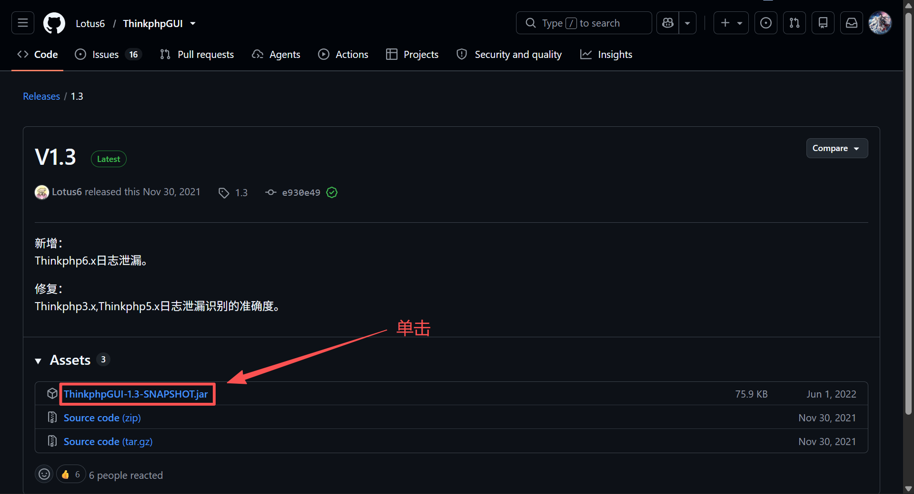

用终端打开本地存储文件夹，运行命令

```bash
java -jar ThinkphpGUI-1.3-SNAPSHOT.jar
```

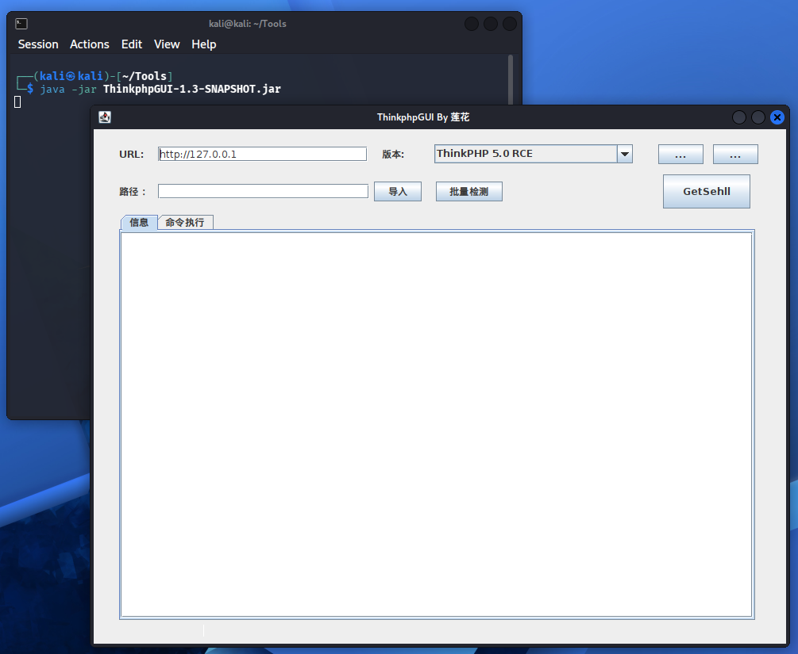

后续，为方便称呼，我们直接称其为 “莲花”。

### 冰蝎 安装与使用教程

[冰蝎](https://github.com/rebeyond/Behinder/releases/tag/Behinder_v4.0.7)

下载 ```.zip``` 文件

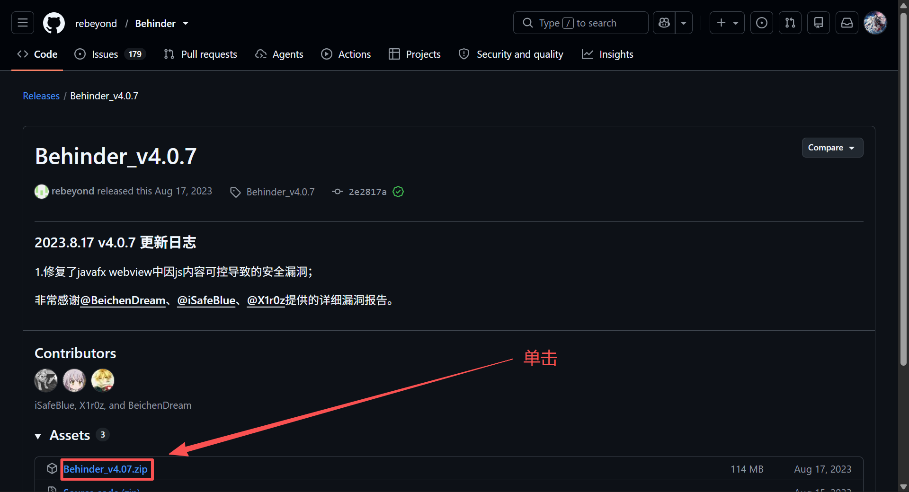

在 kali 中解压后，使用终端打开本地存储文件夹，运行命令

```bash
java -jar Behinder.jar
```

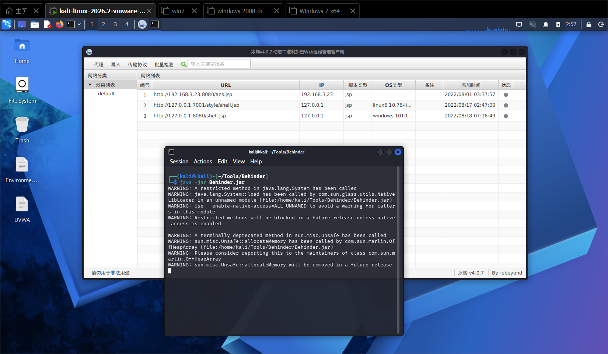

>[!TIP]
>
>对于 冰蝎 v4.0.7 而言，过高的 JDK 版本也会导致报错
>请下载低版本 [JDK11](https://adoptium.net/zh-CN/temurin/releases?version=11&os=any&arch=any)
>并在启动客户端前运行命令，临时更改 JDK 版本
>
>```bash
># 格式为：export JAVA_HOME= <path to jdk-11>
>export JAVA_HOME=/home/kali/Tools/jdk-11.0.32+9/
>```
>
>与
>
>```bash
>export PATH=$JAVA_HOME/bin:$PATH
>```
>
>然后再在同一终端启动客户端

### Cobalt Strike 安装与使用教程

[Cobalt Strike](https://lololowe.lanzoul.com/b0fpjwwxc?pwd=2xhh) 密码是：```2xhh```

[Cobalt Strike 安装和基本使用方式](https://blog.lololowe.com/posts/7126/)

在 kali 中解压缩，分别用两个终端打开文件夹。

在终端 1 中，运行命令，启动 Cobalt Strike 服务端

```bash
# 格式为： sudo ./teamserver <kali NAT ip> <kali password>
sudo ./teamserver 192.168.114.132 kali
```

正常情况如下：

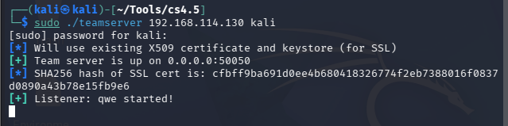

在终端 2 中，运行命令，启动 Cobalt Strike 客户端

```bash
./cobaltstrike
```

如下配置

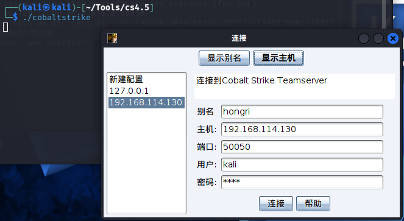

>[!TIP]
>
>第一次运行时有概率因没有执行权限而报错
>请运行：
>
>```bash
>chmod +x teamserver
>```
>或
>```bash
>chmod +x cobaltstrike
>```
>以添加相应权限

>[!TIP]
>
>对于 cs4.5 而言，过高的 JDK 版本也会导致报错
>请下载低版本 [JDK11](https://adoptium.net/zh-CN/temurin/releases?version=11&os=any&arch=any)
>并在启动客户端前运行命令，临时更改 JDK 版本
>
>```bash
># 格式为：export JAVA_HOME= <path to jdk-11>
>export JAVA_HOME=/home/kali/Tools/jdk-11.0.32+9/
>```
>
>与
>
>```bash
>export PATH=$JAVA_HOME/bin:$PATH
>```
>
>然后再在同一终端启动客户端

---

## 实验过程

>[!TIP]
>
>建议在实验开始前，给两台机器分别打上快照，方便后续重复实验。
>
>关机状态打快照速度更快

>[!TIP]
>
>由于靶机的配置相对较差，有的时候反应较慢，请耐心等待，避免因重复操作而产生非预期结果。

### 启动服务网页服务

打开 win7 的 C 盘，进入 phpStudy 文件夹，双击运行 phpStudy.exe 文件，输入管理员账号密码：```Administrator/dc123.com```，点击 启动 按钮。

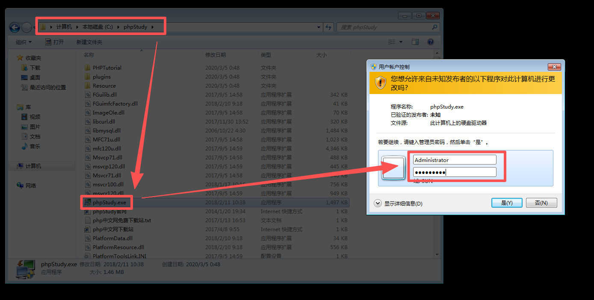

使用 Internet Explorer 8 访问 localhost 查看网页服务是否正常启动。

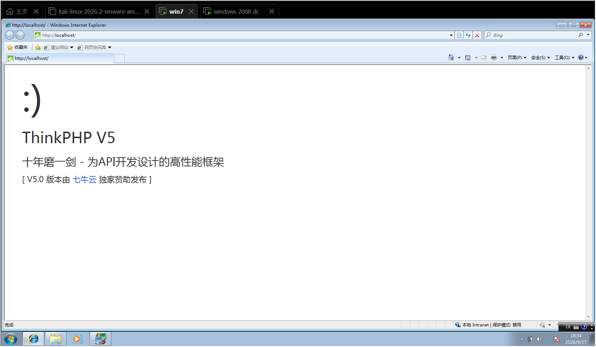

>[!NOTE]
>
><details>
><summary> 
>我们打开的这个网页是个是么东西？ 
></summary>
>
>$\;$
>
>它不是一个真正意义上的网站，而是一个 ThinkPHP V5 框架的默认欢迎页面。
>
>具体来说：这个网页以及未来可能要搭建的网站都是由 ThinkPHP 这个 PHP 开发框架生成的。
>
>这个页面是框架安装成功后的初始页面，说明服务器上已经成功部署了 ThinkPHP 框架，但尚未添加任何实际的网站内容。
>
></details>

>[!TIP]
>
>这里是在 win7 打开网站，用于确定 web 服务搭起来了，确保实验能正常进行，需要和后续在 kali 上打开区分。

### 外网信息搜集

#### 网段扫描

<details>
<summary>
我个人认为其实完全没有必要。
</summary>

$\;$

在实际工作中，如果有渗透测试的要求，甲方一般会在合同中写明授权测试范围是具体哪几个网段或哪几个 ip 地址。请根据实际情况进行扫描。

</details>

>[!CAUTION]
>
>对未授权网段或者 ip 地址进行详细扫描构成违法行为。

<details>
<summary>
学习如何进行网段扫描
</summary>

$\;$

在 kali 上打开终端运行命令扫描网段内活跃主机。

```bash
nmap -sn 192.168.114.0/24
# -sn 不进行端口扫描，仅扫描活跃主机，提高速度
```

>[!NOTE]
>
><details>
><summary>
>为什么是 xxx.xxx.xxx.0/24
></summary>
>
>$\;$
>
>首先，我们需要知道 ipv4 地址是 32 位的二进制数
>
>```/24``` 表示前 24 位是网络号，属于同一网段，要扫描的就是这个网段下的 $2^8=256$ 个网络地址。
>
>所以最终的扫描范围就是：
>
>```
>192.168.114.0    ← 网络地址（不可用）
>192.168.114.1    ← 通常是网关
>192.168.114.2
>192.168.114.3
>...
>192.168.114.254  ← 最后一个可用主机
>192.168.114.255  ← 广播地址（不可用）
>
>可用主机：1 ~ 254，共 254 台
>```
>
>Q: 那为什么不是 .1/24 或 .132/24?
>
>A: 不是不行，只是大家约定俗成写成 .0/24，写成 .1/24 或 .132/24 也能表示同一网段不过就是不规范罢了
>
></details>

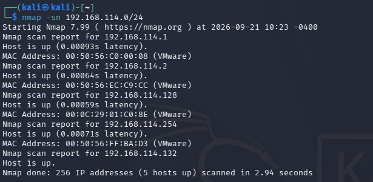

</details>

#### 端口扫描

我们在 kali 上打开终端，运行命令，扫描 win7 所有端口

```bash
nmap 192.168.114.128
```

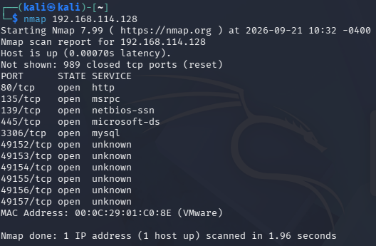

通过扫描我们发现它开放了 $80$ 端口，运行了一个 HTTP 服务。

那么，我们就可以直接用 Firefox 访问 192.168.114.128

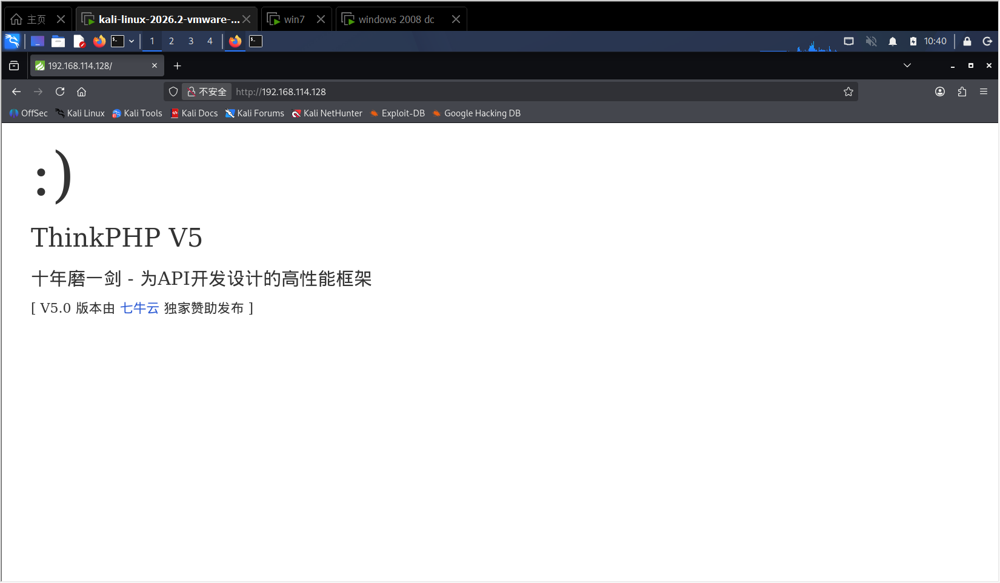

>[!NOTE]
>
><details>
><summary>
>192.168.114.128 不是 win7 的 ip 地址吗？为什么可以直接用浏览器访问？
></summary>
>
>$\;$
>
>我们或许习惯于在浏览器地址栏输入：```baidu.com```去访问网页。但实际上，浏览器需要的是 ```baidu.com``` 这个域名通过 DNS 服务器 解析出来的 ip 地址（111.63.65.103）。
>
>当我们在浏览器地址栏输入 192.168.114.128 并按回车确认后，浏览器实际上是在向 192.168.114.128 请求访问 80 端口（浏览器默认采用 80 端口支持的 HTTP 服务，如果是 HTTPS 服务则一般是采用 443 端口）。
>
>截至目前只是请求访问，具体能否访问成功，还要取决于对应 ip 地址的主机是否监听了 80 端口以及是否在其上部署了服务。
>
>依然用店铺来举例，浏览器拿到了目标 ip，于是他派了一个人前往目标 ip 的 80 号店铺敲门。
>
>- 如果目标主机没有监听 80 端口，相当于 80 号店铺无人值守，自然不会有人给你开门，也就自然不会有响应。
>
>- 如果目标主机监听了 80 端口，则相当于 80 号店铺有人值守，门开了，访问成功。
>
>- - 但是，如果目标主机没有部署相应服务，则相当于，门开了，但是店铺是空的，值守人员开了门，跟你打了个招呼然后就沉默了。
>
>- - 而我们的 win7 部署了相应服务，所以值守人员不仅打开了店铺的门，打了招呼，还将访问人员迎进了店铺内，并展示店铺里的商品，也就是提供了相应的服务，浏览器就会能看到网页。
>
></details>

通过这个页面我们可以知道这个网页由 ThinkPHP V5.0 这个 PHP 开发框架生成的。而这个框架的默认目录是已知公开的，无需像红日靶场 1 一样进行目录爆破。后续可以直接针对其进行常见漏洞扫描。

### 突破外网服务器

#### 漏洞扫描

我们打开莲花工具，填入 URL，版本选择 All。如图操作，进行漏洞扫描。

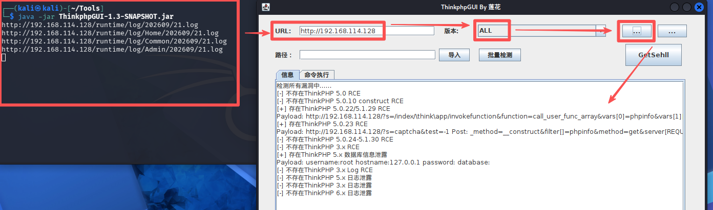

观察发现，这个网页存在 ```ThinkPHP 5.0.22/5.1.29 RCE```、```ThinkPHP 5.0.23 RCE``` 和 ```ThinkPHP 5.x数据库信息泄露``` 这三个漏洞。

我们切换到命令执行栏，版本选择扫描出来第一个漏洞 ```ThinkPHP 5.0.22/5.1.29 RCE```，点击执行按钮。

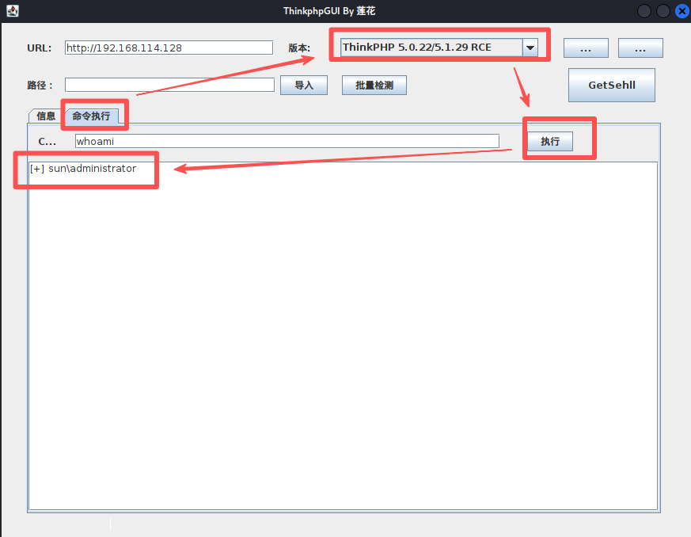

命令成功执行，返回 ```sun\administartor```。

如图操作，清理显示区。

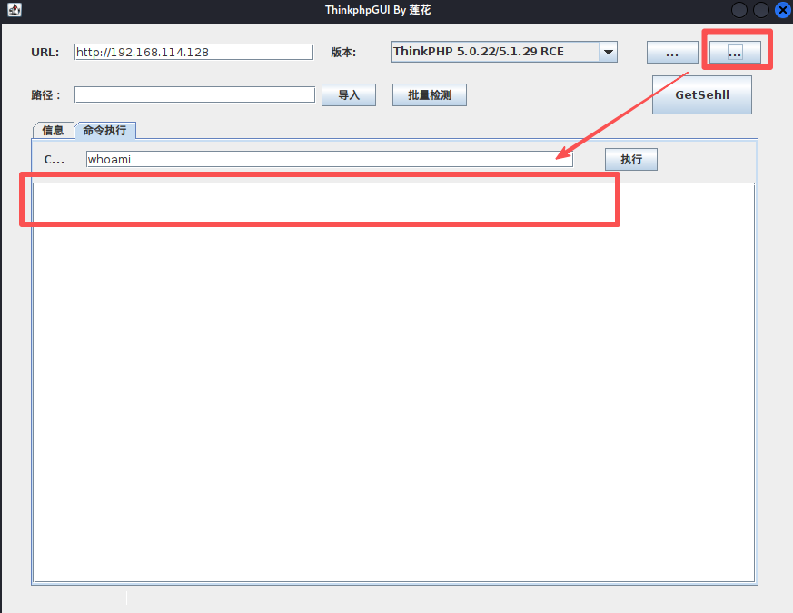

版本选择扫描出来的第二个漏洞 ```ThinkPHP 5.0.23 RCE```，点击执行按钮。

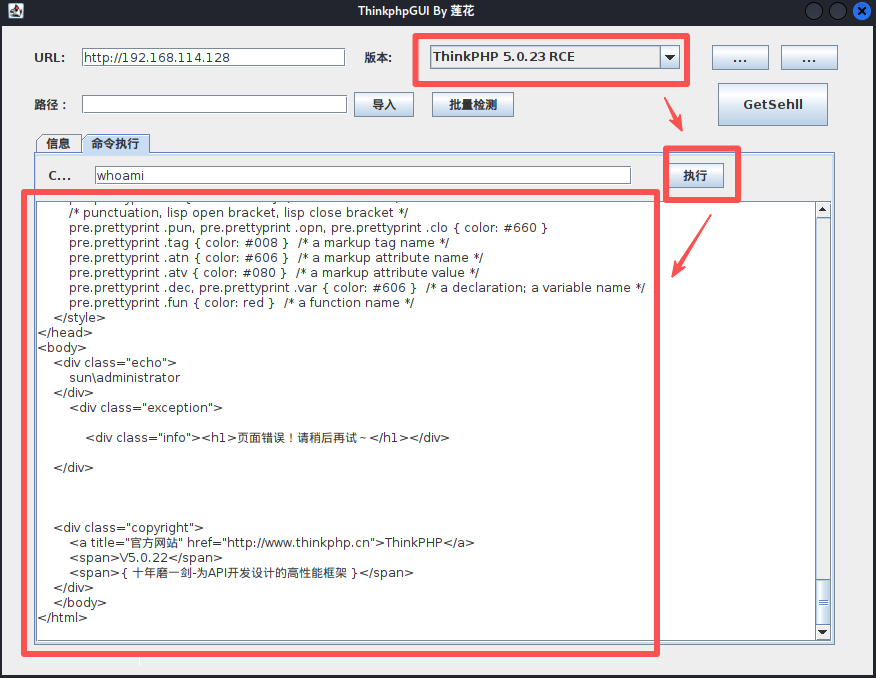

命令成功执行，但返回的是一个整页的报错 HTML 页面，我们用浏览器打开，页面如下。

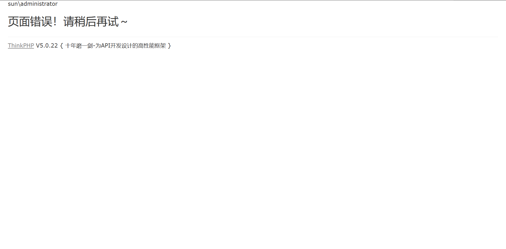

倒也可以看到返回的 ```sun\administartor```。

如图操作，清理显示区。

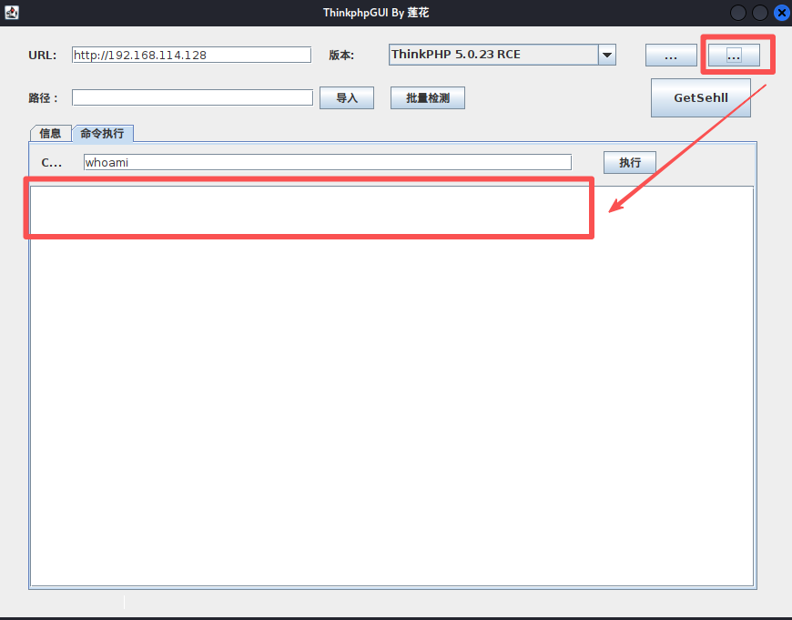

版本选择扫描出来的最后一个漏洞 ```ThinkPHP 5.x数据库信息泄露```，点击执行按钮。

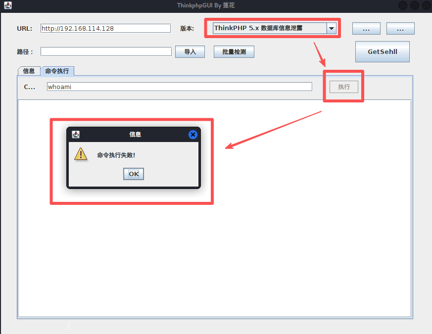

发现命令执行失败。

>[!NOTE]
>
><details>
><summary>
>这条 whoami 命令是怎么执行的？为什么在不同的漏洞种类下，产生的效果不一样？
></summary>
>
>$\;$
>
>把 ThinkPHP 想象成一家餐厅流水线：接单 $\rightarrow$ 分单 $\rightarrow$ 检查订单 $\rightarrow$ 做菜 $\rightarrow$ 上菜。我们要执行的 whoami 就是一道偷偷加塞的菜。三个漏洞的区别，只在于在哪个环节把这道菜塞进去，以及这个环节能不能做菜。
>
>**5.0.22/5.1.29 RCE：直通厨房的 “外卖热线”**
>
>这个漏洞相当于餐厅留了一条正规热线，可以直接点名让厨房做某道菜。你打过去说 “做一道 ```whoami```”，厨房做完，服务员原封不动端给你。盘子里只有菜，没有别的东西。所以扫描器看到的就是干干净净的 ```sun\administrator```。
>
>**5.0.23 RCE：往 “验单机” 里塞纸条**
>
>这个漏洞没有直通的门路，你的办法是：在订单检查环节动了手脚，骗验单机器 “顺便” 把 ```whoami``` 做了。
>
>菜确实做出来了（命令执行成功），但验单机被你搞乱了，后面的流程全乱套，餐厅警报大作。最后服务员端给你的不是你的菜，而是一整份厚厚的《事故报告》（就是那个错误页面 HTML），你的菜被别在报告的第一页，也就是输出中 body 部分的第一段。
>
>所以，这不是执行失败，而是结果被打包进了错误页，用浏览器打开这份 “报告” 自然能看到 ```sun\administrator```。
>
>**数据库信息泄露：嘴不严的收银员**
>
>这个漏洞压根不是做菜通道。它更像一个嘴不严的收银员：你故意问一个刁钻的问题，他一慌张就把保险柜密码（数据库账号）说漏了。
>
>他的本事只有 “说漏嘴”，从来进不了厨房。你让他做一道 whoami，他当然做不到，所以扫描器直接报"命令执行失败"。这个模块的正确用法是套数据库的账号密码，不是执行命令。
>
></details>

显然，漏洞 ```ThinkPHP 5.0.22/5.1.29 RCE``` 是我们利用的最佳选项。

#### getshell

>[!NOTE]
>
>getshell 指‌拿到目标服务器的命令执行权限‌。

我们切换回信息栏，版本选择 ```ThinkPHP 5.0.22/5.1.29 RCE```，点击 Getshell 按钮。

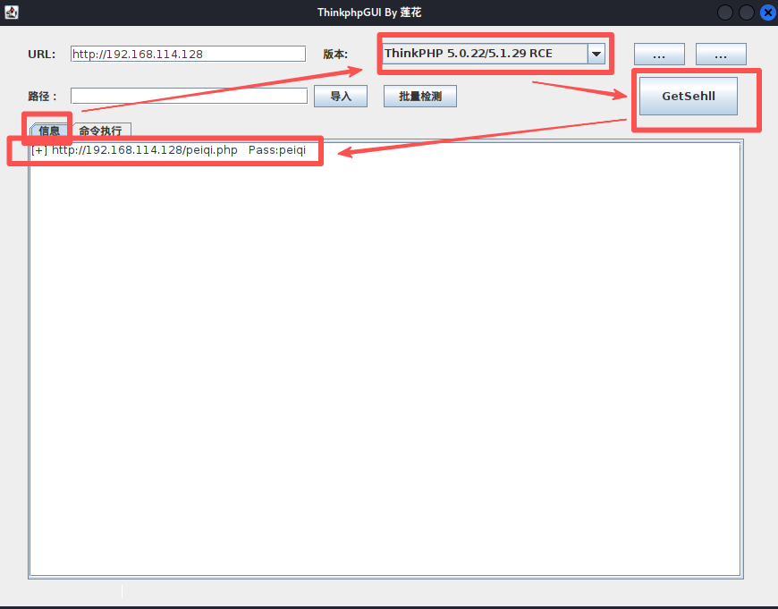

如图我们可知：这个工具帮我们上传了一句话木马到服务器。

我们打开蚁剑进行连接。

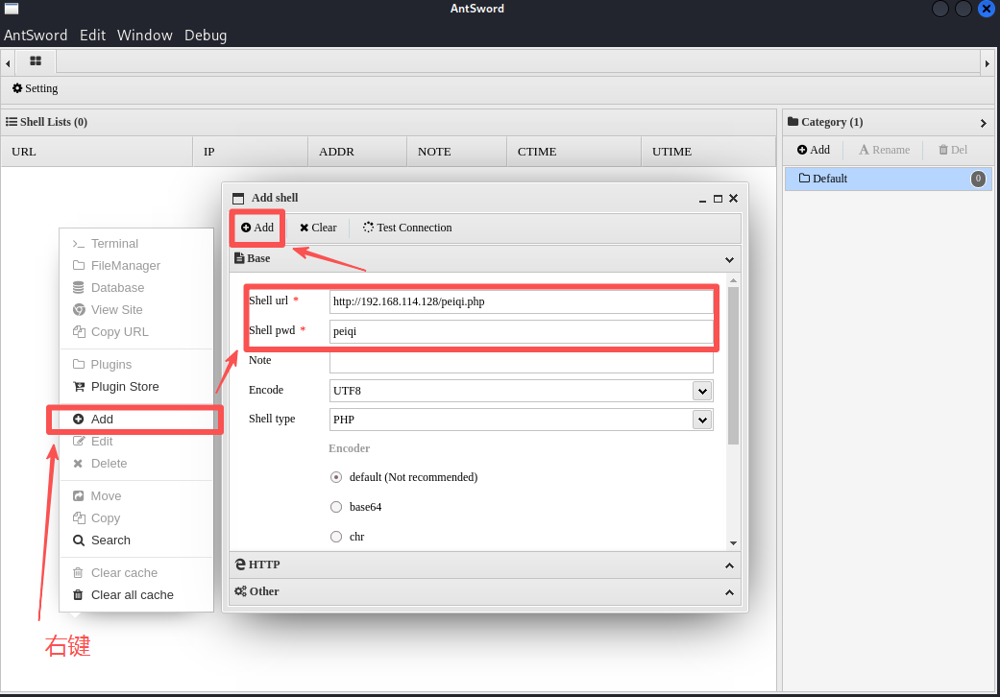

双击进入文件管理界面。

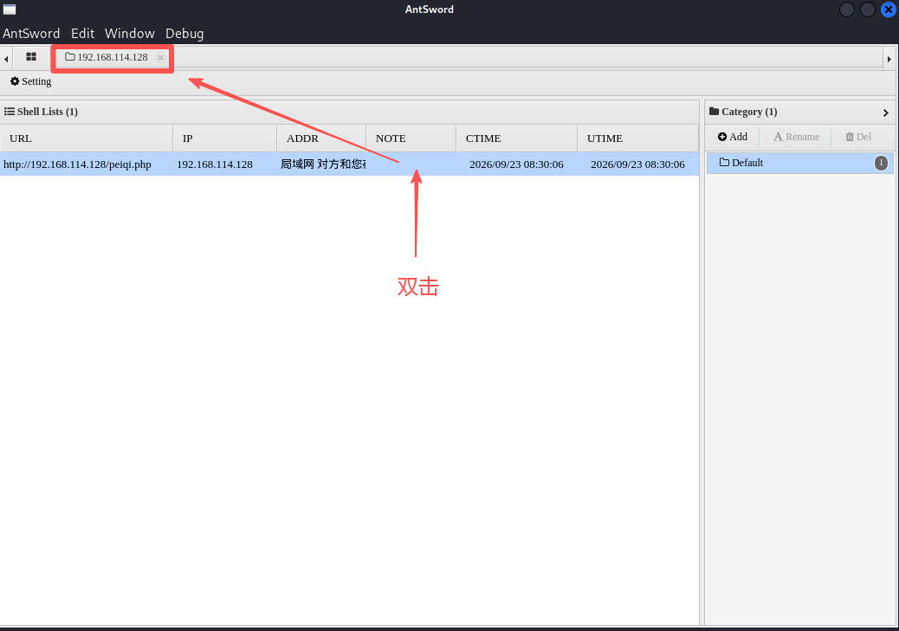

右键新建文件，命名为 ```bx.php```。

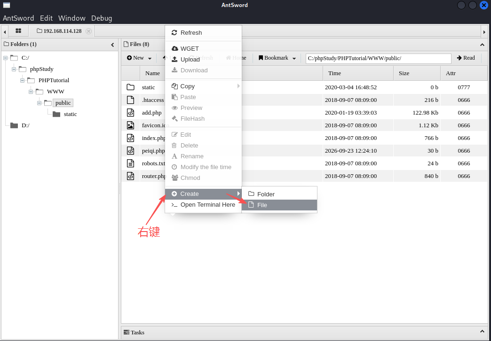

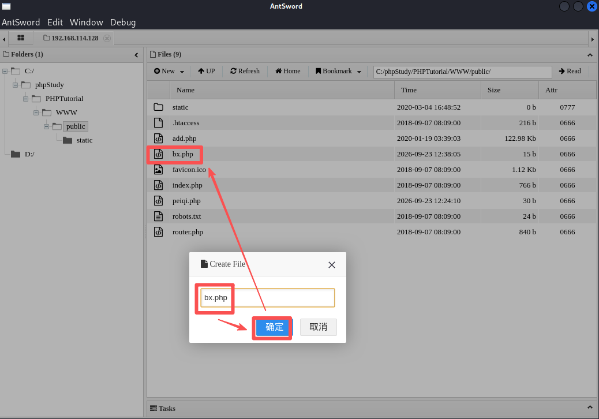

我们找到冰蝎的文件目录，进入 ```server``` 子目录，找到 ```shell.php``` 文件，将内容 copy 到上传的 ```bx.php``` 中。

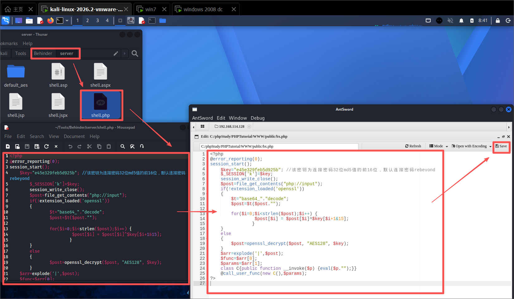

打开冰蝎，右键，新增，填入 URL，版本类型选择 PHP，加密类型选默认，连接密码填入默认密码：```rebeyond```。

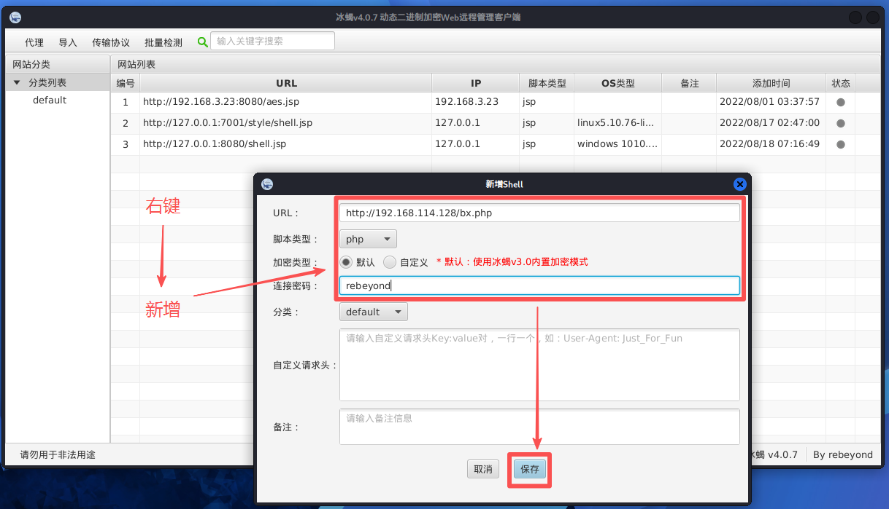

双击该网站，找到存储 ```peiqi.php``` 和 ```bx.php``` 的文件路径，删除 ```peiqi.php```。

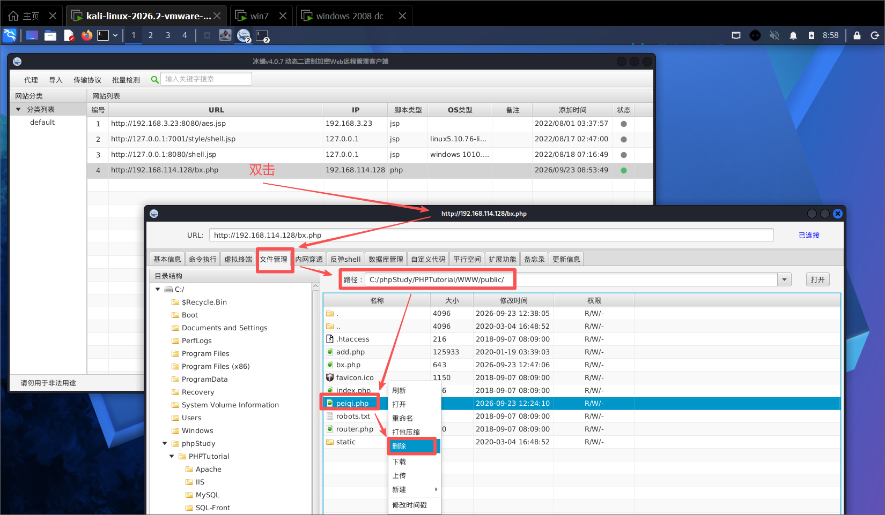

>[!NOTE]
>
><details>
><summary>
>为什么我们要大费周章的用蚁剑连接后上传 bx.php 再用冰蝎连接？直接继续用蚁剑不香吗？以及为什么冰蝎连接后我们要删掉原来的 peiqi.php？
></summary>
>
>$\;$
>
>首先，我们要知道：蚁剑使用的一句话木马是通过明文传输，而冰蝎则是用密文传输。那么其中利弊自不必多说（流量隐蔽性、溯源难度）。
>
>冰蝎接管后，蚁剑使用的 peiqi.php 就没有用了，留着只会增大暴露的可能。
>
></details>

### 内网渗透

#### CS 上线

#### 隐蔽进程

#### 提升权限

#### 内网信息搜集

#### 横向移动

#### 制作黄金票据

## 完成实验

## 实验清理

我们可以选择将三台虚拟机恢复到实验前快照的状态，如果没有打快照，那建议直接将四台虚拟机全部扬了重装，以防历史数据影响实验。

---

## 参考文献

1. [红日靶场 05 通关记录](https://cn-sec.com/archives/1040933.html)
2. [红日靶场 5 实战全流程](https://blog.csdn.net/mooyuan/article/details/152000293)
3. [红日靶场五（vulnstack5）渗透分析](https://zhuanlan.zhihu.com/p/654020794)