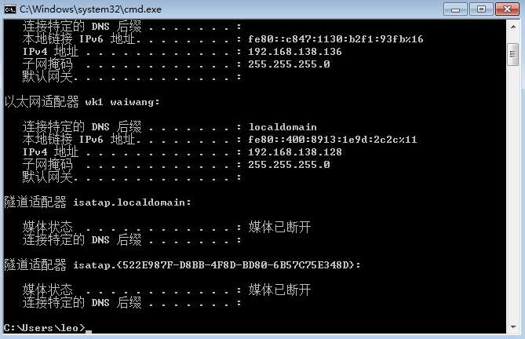

# 红日靶场 5 蒟蒻笔记

---

## 目录

>[!ERROR]
>
>After finishing this whole notes, remember to build TOC

---

## 环境配置

>[!CAUTION]
>
> **警告！**
>
> 为保证不发生不可预测的严重后果，请不要在真实的网络环境中进行此实验。请在虚拟机环境中完成本试验。推荐使用 [VMware Workstation Pro](https://vmware.xznkjzx.cn/)。

>[!IMPORTANT]
>
>1. 你需要下载 [红日靶场 1](http://vulnstack.qiyuanxuetang.net/vuln/detail/2/)
>2. 推荐使用 [kali](https://www.kali.org/) 作为攻击机。

## 靶机配置

windows 2008 原密码：```2020.com```，更改为：```win2008.com```

win7 密码：```123.com```

>[!TIP]
>
>当我们使用命令 ```ipconfig``` 确认检查各虚拟机 IP 地址时有概率发现 win7 的 “以太网适配器 wk1 waiwang” 网络连接，也就是理论上被我们设置为 NAT 模式的网卡一直在使用一个 ```192.168.135.150``` 的 IP 地址。
>
>
>
>我们需要使用 Win+R 快捷键并输入 ```ncpa.cpl``` 打开网络连接控制面板双击 “wk1 waiwang”，单击属性，输入管理员账号密码：```Administrator/dc123.com```
>
>
>
>双击 “Internet 协议版本4 (TCP/IPv4)属性”，改成 “自动获得 IP 地址” 与 “自动获得 DNS 服务器地址”，一路点击 “确定” 保存设置修改。
>
>
>
>再次使用 ```ipconfig``` 命令验证，若 IP 地址变为 ```192.168.138.128```
>
>
>
>可尝试通过调换网卡顺序解决（使 “网络适配器” 为 NAT 模式，“网络适配器 2” 为仅主机模式）
>
>


启动 phpStudy 时会让你输入管理员账号密码：```Administrator/dc123.com```

---

## 参考文献

1. [红日靶场05通关记录](https://cn-sec.com/archives/1040933.html)